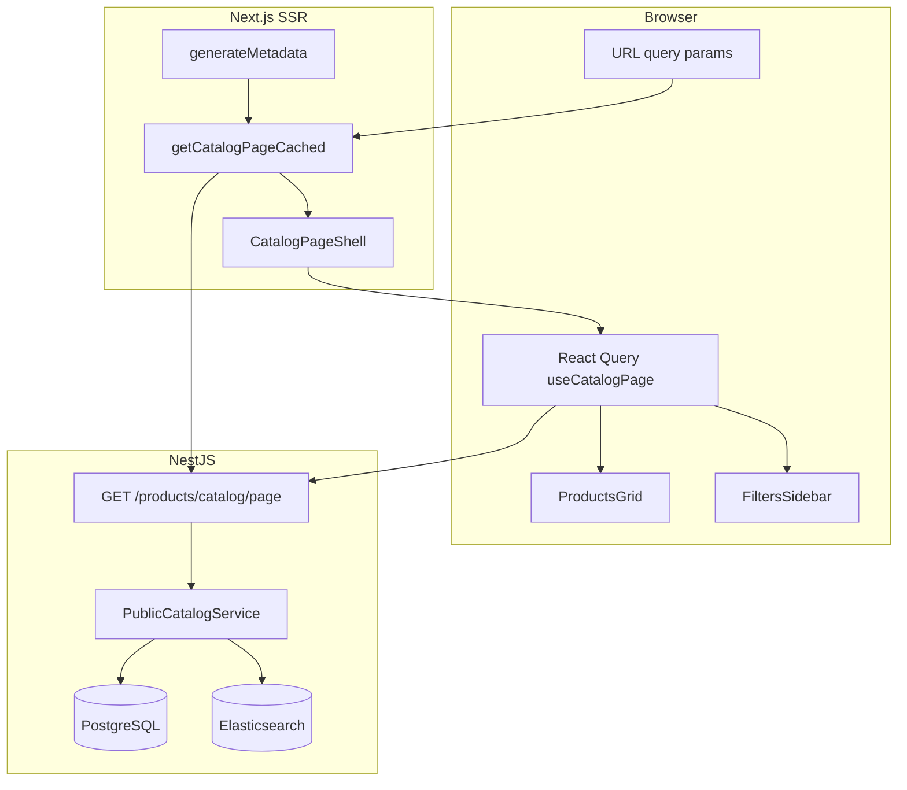

# Каталог товаров — как работает приложение

Документ описывает **текущую** архитектуру публичного и админского каталога после серверной пагинации, faceted-фильтров и SEO-оптимизации.

---

## Обзор

| Область | Маршруты | Данные |
|--------|----------|--------|
| **Публичный каталог** | `/catalog/products`, `/catalog/products/[category]`, `/catalog/products/[category]/[subcategory]` | Серверная пагинация, фильтры, сортировка; URL — единственный источник состояния |
| **Карточка товара** | `/product/[slug]` | Отдельный API товара |
| **Админка каталога** | `/admin/catalog/products` | React Query, серверный список с фильтрами и пагинацией |

Принцип публичного каталога: **не загружать весь каталог на клиент**. Список, счётчики фильтров и пагинация приходят с API; React Query кэширует ответы на клиенте.

---

## Публичный каталог — поток данных

```
URL (?page, ?sort, ?branch, ?search, фильтры…)
        │
        ├─ SSR (Server Component)
        │     getCatalogPageCached() → GET /api/v1/products/catalog/page
        │     ├─ CatalogPaginationLinks  (<link rel="prev|next">)
        │     ├─ CatalogServerProductGrid (SEO-ссылки до гидратации)
        │     └─ CatalogPage (client) с initialPage
        │
        └─ Client (после гидратации)
              useCatalogPage() → тот же GET /catalog/page (React Query)
              useCatalogFilters() → читает filters из того же кэша запроса
              ProductsGrid → products из pageResponse
```

### Маршруты Next.js

| URL | Поведение |
|-----|-----------|
| `/catalog/products` | **Хаб**: превью 3–4 разделов по категориям (переключатель «Популярное / Новинки»), фильтры слева из **GET `/categories`**. Полный каталог — при `?branch=<slug>` |
| `/catalog/products/entrance-doors` | Категория верхнего уровня |
| `/catalog/products/entrance-doors/model-x` | Подкатегория |

### Query-параметры URL

Парсинг: `frontend/src/views/catalog/lib/catalog-search-params.ts`  
Бэкенд: `backend/src/products/dto/public-catalog-list.dto.ts`

| Параметр | Назначение |
|----------|------------|
| `page` | Страница пагинации (с 1) |
| `sort` | `default`, `price-asc`, `price-desc`, `name-asc`, `name-desc`, `new`, `rating` |
| `branch` | На хабе — slug родительской категории для загрузки товаров и фасетов |
| `search` | Поиск по названию/SKU (ES или PostgreSQL fallback) |
| `price_min`, `price_max` | Диапазон цены |
| `avail` | Наличие: `in_stock`, `on_order`, `out_of_stock` |
| `mfr` | ID производителя (повторяемый) |
| `cat` | Slug подкатегории (повторяемый) |
| `attr_<filterId>` | Значения атрибутного фасета (повторяемый) |

---

## Backend API (публичный каталог)

Контроллер: `backend/src/products/products.controller.ts`  
Сервис: `backend/src/products/public-catalog.service.ts`

### Основные endpoints

| Метод | Путь | Назначение |
|-------|------|------------|
| GET | `/products/catalog/page` | **Рекомендуемый**: список + `filters` + `categoryFilterOptions` одним ответом (SSR и клиент) |
| GET | `/products/catalog/list` | Только список (совместимость, отдельные клиенты) |
| GET | `/products/catalog/filters` | Только faceted-фильтры |
| GET | `/products/catalog/sitemap-data` | Slug категорий и товаров для `sitemap.xml` |
| GET | `/products/catalog/hub-preview?mode=featured\|new` | Превью разделов на хабе `/catalog/products` |

Удалён: **`GET /products/catalog/all`** — не использовать.

### Faceted-фильтры

- Конфигурация блоков фильтров: сущности `CatalogFilterBlock` в БД, сервис `CatalogFilterBlocksService`.
- Для каждого фасета (производитель, наличие, атрибут) счётчики пересчитываются с **cross-filter**: применяются все активные фильтры **кроме текущего** фасета.
- Блок «Подкатегории» (`categoryFilterOptions`): счётчики **без учёта `?cat=`**, но с учётом остальных фильтров.

### Поиск и сортировка

- При `?search=` и доступном **Elasticsearch** ID товаров берутся из ES; при `sort=default` порядок — **по релевантности ES**, затем `sortOrder`.
- Если ES недоступен — поиск по `name`/`sku` в PostgreSQL (ILIKE).
- Сортировка `rating` — по среднему рейтингу одобренных отзывов.

### Индекс БД

Миграция `20260605120000_product_catalog_list_index`:

```sql
CREATE INDEX ON products("categoryId", "isActive", "sortOrder");
```

Ускоряет выборку активных товаров категории при сортировке по умолчанию.

---

## Frontend (публичный каталог)

### Ключевые модули

| Файл | Роль |
|------|------|
| `shared/api/public-catalog-list.ts` | HTTP-клиент к API |
| `views/catalog/lib/useCatalogPage.ts` | React Query: один запрос `/catalog/page` |
| `views/catalog/lib/useCatalogFilters.ts` | Фильтры из того же query cache |
| `views/catalog/lib/get-catalog-page-cached.ts` | `react/cache` — один fetch на SSR-рендер (page + metadata) |
| `views/catalog/lib/fetch-catalog-hub-categories.ts` | Категории для хаба (`GET /categories` → опции `?branch=`) |
| `views/catalog/lib/fetch-catalog-hub-preview.ts` | SSR-превью хаба (`GET /products/catalog/hub-preview`) |
| `views/catalog/lib/useCatalogHubCategories.ts` | React Query для хаба без `?branch=` |
| `views/catalog/lib/useCatalogHubPreview.ts` | React Query для превью (режим featured/new) |
| `views/catalog/ui/CatalogHubPreview/` | Блоки разделов на хабе, кнопка «Смотреть все» |
| `views/catalog/ui/CatalogPageShell.tsx` | SSR-оболочка: prev/next, SEO-сетка, CatalogPage |
| `views/catalog/ui/ProductsGrid/` | Сетка карточек, сортировка, inline-редактирование цены |
| `views/catalog/lib/patch-catalog-page-cache.ts` | Обновление цены в query cache после PATCH |

### Пагинация

- Desktop: 15 товаров на страницу; mobile: 16 (`useCatalogProductsPerPage`).
- Пагинация в URL (`?page=2`); при смене фильтров страница сбрасывается на 1.

### Inline-редактирование цены (публичный сайт)

При сохранении цены с карточки (`ProductCard` + `patchProductPricing`) ответ PATCH попадает в React Query cache через `patchProductInCatalogPageCache` — сетка обновляется без перезагрузки.

---

## SEO

Реализация: `frontend/src/views/catalog/lib/catalog-seo.ts`, `app/sitemap.ts`, `app/robots.ts`.

### Индексация (robots)

**Индексируются** «чистые» URL категорий и пагинация без фильтров.

**Noindex** (follow: true):

- `?search=`
- `?sort=` (кроме default)
- любые фильтры (`price_min`, `mfr`, `cat`, `attr_*`, …)

### Canonical и prev/next

- `generateMetadata` → `buildCatalogMetadata`: canonical, `alternates.prev` / `alternates.next`.
- Server Component `CatalogPaginationLinks` → `<link rel="prev|next">` в `<head>`.

### SSR для краулеров

- `CatalogServerProductGrid` — HTML-ссылки на товары (`#catalog-seo-fallback`); после загрузки клиентской сетки скрывается (`CatalogSeoFallbackController`).
- `CatalogItemListJsonLd` — schema.org `ItemList`.

### Sitemap

`app/sitemap.ts` → `GET /products/catalog/sitemap-data` (лёгкий список slug, revalidate 1 ч).

---

## Кэширование (ISR)

### Когда кэшируется

`isCacheableCatalogRequest()` — только индексируемые URL (см. robots выше).

- **Next.js Data Cache**: `revalidate: 60` секунд.
- Теги: `catalog-page-{slug}[-p{N}]`, общий `catalog-pages`, `catalog-hub-preview` (превью хаба, revalidate 60 с).

### Инвалидация после изменения товара

При сохранении в админке (`ProductEditPage`, `ProductCreatePage`):

```http
POST /api/revalidate
{ "paths": ["/product/{slug}", { "path": "/catalog/products", "type": "layout" }], "tags": ["catalog-pages"] }
```

Сбрасывается ISR каталога и layout; клиентский React Query в админке инвалидирует список товаров отдельно.

### Запросы с фильтрами

Всегда `cache: 'no-store'` — персонализированная выдача не кэшируется на CDN.

---

## Админский каталог товаров

| Компонент | Путь |
|-----------|------|
| UI | `frontend/src/views/admin/Catalog/Products/ProductsPage.tsx` |
| API | `GET /api/v1/admin/catalog/products` |
| Сервис | `backend/src/admin/catalog/products/admin-products.service.ts` |

### Возможности списка

- Серверная **пагинация**, **сортировка**, **фильтры** (категория + потомки, остаток, автор, цена, active/featured/new).
- Slim DTO без `description` — быстрая загрузка больших списков.
- React Query (`QueryProvider` в admin layout); после сохранения товара — `invalidateQueries`.

### Дополнительные endpoints

- `GET /admin/catalog/products/authors` — авторы для фильтра
- `GET /categories/attributes/by-categories?ids=` — атрибуты выбранных категорий

---

## Связанные сущности

- **Категории**: `/admin/catalog/categories`, дерево slug → публичные URL.
- **Блоки фильтров каталога**: настройка фасетов по категории (наличие, производитель, атрибуты).
- **Превью хаба каталога**: `/admin/settings/catalog-hub-preview` — до 4 корневых категорий, ручной подбор товаров для «Популярное» / «Новинки»; API `GET|PUT /admin/catalog/hub-preview`.
- **Elasticsearch**: индекс `products`; переиндексация — см. `docs/MIGRATION-REG-TO-TIMEWEB.md` (`/admin/catalog/products/reindex-elasticsearch`).

---

## Деплой и проверка на production

### 1. Миграции

```bash
docker compose -f docker-compose.infra.yml -f docker-compose.prod.yml exec backend npx prisma migrate deploy
```

Убедитесь, что применена миграция индекса `20260605120000_product_catalog_list_index`.

### 2. Пересборка и перезапуск

После push в `main` — pull образов и `up -d` (см. `DEPLOYMENT.md`).

### 3. Чеклист smoke-теста

**Публичный каталог**

- [ ] `/catalog/products` — без `branch` видна колонка «Категории» (радио-выбор раздела), не пустая страница без фильтров
- [ ] `/catalog/products?branch=entrance-doors` — товары и фильтры
- [ ] `/catalog/products/entrance-doors` — SSR: View Source содержит ссылки в `#catalog-seo-fallback`
- [ ] Фильтр производителя → счётчики других фасетов и подкатегорий уменьшаются
- [ ] Пагинация `?page=2` — в `<head>` есть `rel="prev"` / `rel="next"`
- [ ] DevTools Network: при смене фильтра **один** запрос к `/products/catalog/page`
- [ ] `GET /products/catalog/all` → **404**
- [ ] `/sitemap.xml` — категории и товары из `sitemap-data`

**Админка**

- [ ] `/admin/catalog/products` — быстрый список, фильтры, пагинация
- [ ] Сохранение товара → список обновляется; на публичке — после revalidate

**Поиск**

- [ ] `?search=` + `sort=default` — порядок по релевантности (если ES включён)

### 4. Откат

Старый endpoint `/catalog/all` удалён. Откат — только через git revert и redeploy; фронт на него не ссылается.

---

## Диаграмма (упрощённо)



---

## См. также

- [DEPLOYMENT.md](../DEPLOYMENT.md) — production-деплой
- [docs/TESTING.md](./TESTING.md) — E2E, в т.ч. `catalog-to-cart.spec.ts`
- [docs/PWA.md](./PWA.md) — кэш service worker (отдельно от ISR каталога)
